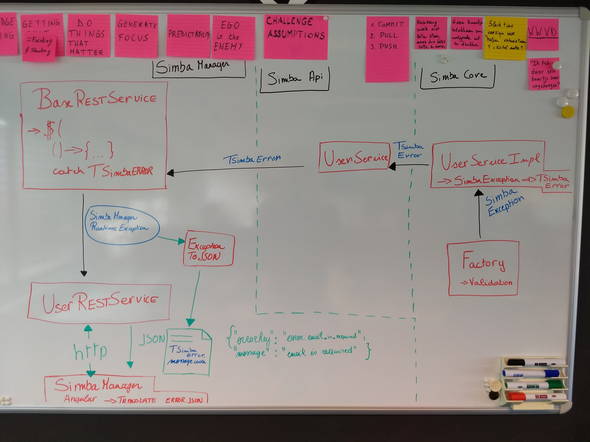
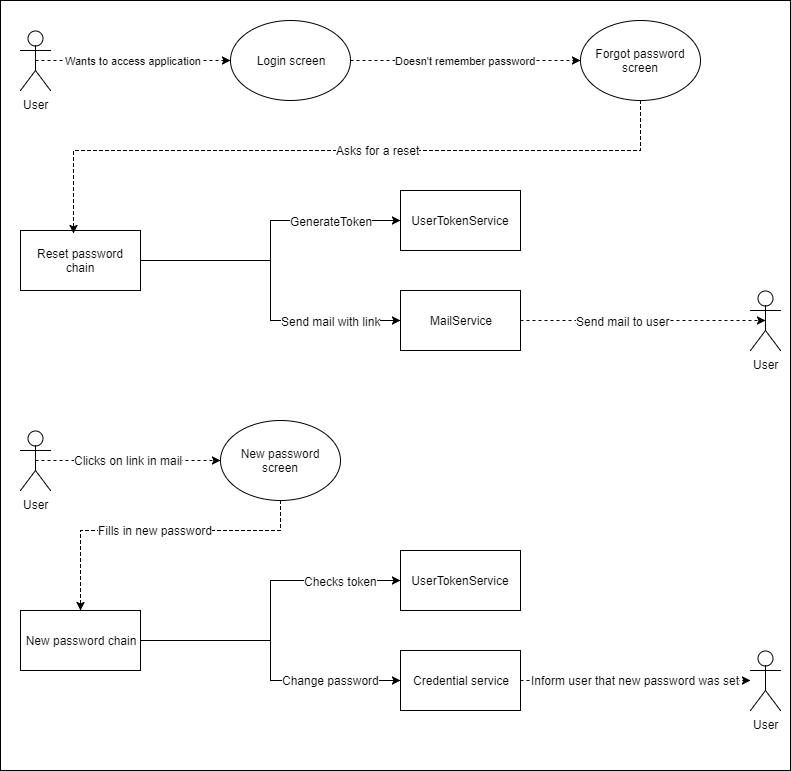

# Captain's log
## February 2018 - Proper error messages in SimbaManager
Starting situation: errors in SimbaManager web are extremely generic and provide no information to the user of what happened.
For example, when an email is required, email already exists, username too short/long, or even optimistic locking occurred, the message on the web page says _something went wrong creating/updating data_.

To decrease work load for 1st line support, proper error messages are a must.

There are a couple of hurdles we need to overcome before we can pass domain validations (from simba-core) to the SimbaManager web app:

* The Thrift services all need to throw a specific error type e.g. `TSimbaError`.
* The `ServiceImpl`s (e.g. `UserServiceImpl`) should catch `SimbaException`s and throw `TSimbaError`s instead.
* The `BaseRESTService` needs to take into account `TSimbaError`s and throw `SimbaManagerRuntimeException`s.
* Then we'll need a generic way of translating those `SimbaManagerRuntimeException`s into JSON.
* And only then can we start to deal with those JSON error types in AngularJS and use the `error.json` files to map and translate those messages.

Worth noting is that we're breaking the API again with these changes, so simba _customers_ will need to update their simba-api and simba-client jars.

On 12/02/2018 we ran into the following issue:
When checking that the frontend would receive the thrown error for `USER_ALREADY_EXISTS_WITH_EMAIL` 
We received `TransactionInterceptor - Application exception overridden by commit exception`, this was caused by the following:
* UserServiceImpl and UserFactory was annotated with @Transactional. This created a transaction within a transaction.
* TException is a custom/checked exception
* Transactionmanager doens't rollback for automaticly for checked exception

The SimbaException was caught and the inner transaction was marked for rollback due to the SimbaException.
A new TSimbaError(TException) was thrown but it didn't mark the outer transaction for rollback(remained commit)
The commit didn't go through as the there was a conflict(commit vs rollback). This is the error we received.

By removing the inner transaction(on UserFactory) and explicitly specifying rollback for the TException class 
on the remaining outer transaction, the exception was caught and passed on correctly to the front-end

## December 2017 - Reset password via mail
Since GDPR will go live in may 2018 we are looking at potential security risks. 
One of these risks is using a default password when resetting a password.

We have implemented a more secure system where the user will receive a mail whereby he can reset his password.

