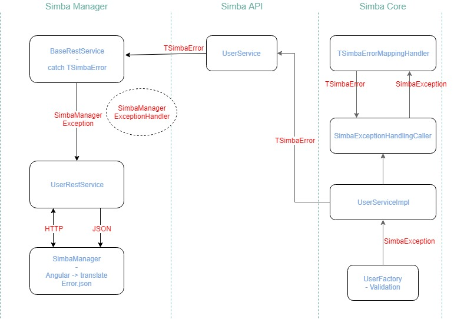

# SimbaManagerException framework
###Old situation 
In the backend while creating or updating a user, we do a few validations. If one of the validations fails we throw a SimbaException, which is visible in the server log. In the frontend we just check if something went wrong and if so, we throw a general error which says e.g. something went wrong during the update of the data.

_The problem is that it's unclear to a user what exactly went wrong._

###New situation
The validation still happens, but now we throw the error to the frontend. (see image below)

## Error message flow

## Glossary

`TSimbaErrorMappingHandler`: maps SimbaExceptions to TSimbaErrors with correct errorkeys values.

`SimbaExceptionHandlingCaller`: Uses handler and is injected into SimbaCore services for easier testing.

`BaseRESTService`: catches TSimbaErrors and rethrows `SimbaManagerExceptions`.

`SimbaManagerExceptionHandler`: Translates `SimbaManagerException`s to JSON using a `@ControllerAdvice` and a `ResponseEntity`.

## Spring docs material we used

[MVC ExceptionHandlers](https://docs.spring.io/spring/docs/4.3.6.RELEASE/spring-framework-reference/htmlsingle/#mvc-exceptionhandlers)

[ResponseEntityExceptionHandler](https://docs.spring.io/spring/docs/4.3.6.RELEASE/javadoc-api/index.html?org/springframework/web/servlet/mvc/method/annotation/ResponseEntityExceptionHandler.html)

[ControllerAdvice](https://docs.spring.io/spring/docs/4.3.6.RELEASE/javadoc-api/org/springframework/web/bind/annotation/ControllerAdvice.html)

